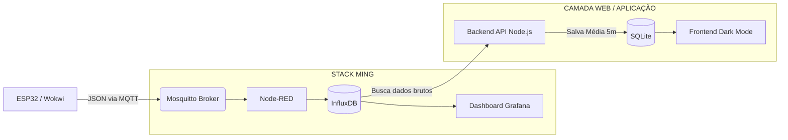

# 🌡️ Monitoramento de Racks - IoT Data Pipeline

Repositório destinado à entrega do projeto prático da disciplina de **Programação Multiplataforma**, curso de Análise e Desenvolvimento de Sistemas (ADS), ministrada pelo professor **Andre Cassulino**.

---

## 📺 Vídeo de Apresentação (Pitch)
> **Clique no link abaixo para assistir à demonstração completa da solução:**
> ### 🔗 [ASSISTIR VÍDEO NO YOUTUBE](https://youtu.be/u7eCPDVRQMs)

---

## 1. Contexto do Projeto
Este projeto simula um cenário crítico de infraestrutura de TI: o monitoramento térmico de racks de servidores em um SOC. O objetivo é criar um pipeline completo que coleta dados de temperatura, processa essas informações na nuvem (AWS) e apresenta médias consolidadas para a tomada de decisão, alertando sobre possíveis danos ao hardware por superaquecimento.

> **Aviso de Arquitetura:** Para otimização de recursos em instâncias cloud *Free Tier* (AWS t2.micro), este projeto utiliza **SQLite** como banco relacional embarcado no container do Backend, garantindo estabilidade e evitando interrupções por falta de memória (OOM) comuns em bancos de dados pesados.

---

## 2. O que foi entregue (Arquitetura)
O projeto contempla as duas etapas evolutivas solicitadas no escopo:

### ETAPA 01 — Stack MING (Pipeline Básico)
- **Dispositivo (IoT):** Script (Wokwi/Python/ESP32) que simula o sensor de temperatura do rack enviando dados via protocolo MQTT.
- **Broker MQTT:** Mosquitto configurado em container Docker.
- **Node-RED:** Orquestração do fluxo de dados entre o Broker e o banco de séries temporais.
- **InfluxDB:** Armazenamento otimizado de dados brutos de alta frequência.
- **Grafana:** Dashboard para visualização de métricas em tempo real.

### ETAPA 02 — Stack Web & Regra de Negócio
- **Backend API:** Desenvolvido em **Node.js**, responsável por consumir o InfluxDB e aplicar a regra de negócio central.
- **Regra de Negócio:** Consolidação automática de dados (cálculo de média de temperatura a cada 5 minutos via *Cron Job*) para redução de granularidade e análise histórica.
- **Banco Relacional:** **SQLite** para persistência leve e rápida das médias processadas.
- **Frontend:** Interface moderna focada em UX (Dark Mode com fonte Poppins), desenvolvida em HTML/CSS/JS puro (Vanilla) para consumo da API REST e exibição de status visual (Estável/Crítico).

---

## 3. Fluxo de Dados (Diagrama)
O diagrama abaixo ilustra o caminho da informação desde o sensor até o usuário final:



---

## 4. Tecnologias Utilizadas:
- **Infraestrutura/Cloud:** AWS EC2 (Ubuntu), Docker, Docker Compose.
- **IoT & Integração:** MQTT, Node-RED.
- **Bancos de Dados:** InfluxDB (Time-series) e SQLite (Relacional).
- **Linguagens e Web:** Node.js, JavaScript, HTML5, CSS3.

---

## 5. Estrutura de Pastas
O repositório está organizado da seguinte forma:
- `📁 /frontend` → Interface web consolidada (`index.html`).
- `📁 /backend` → Código da API Node.js, `Dockerfile`, configuração e arquivo `.sqlite`.
- `📁 /iot` → Scripts de simulação do envio de dados do sensor.
- `📁 /nodered` → Backup do fluxo exportado (`flow.json`) para rápida importação.
- `📁 /docs` → Evidências do projeto (Prints da AWS, logs do Docker e telas rodando).

---

## 6. Integrantes e Divisão de Papéis
| Integrante | Responsabilidades |
| :--- | :--- |
| **Rafaela Riganti** | **IoT/Dados** (ESP32, MQTT, Node-RED) e **Backend/Cloud** (API Node.js, Regras de negócio, Infraestrutura AWS/Docker e SQLite). |
| **Maria Julia Loureiro** | **Frontend** (Desenvolvimento da interface UI/UX e integração via consumo da API REST). |
| **Sophia Araujo** | **Documentação e Explicação** (Organização do repositório, roteiro, diagramação arquitetural e revisão). |

---

## 7. Como executar o projeto
**Passos para subir a Infraestrutura (Backend):**
1. Acesse o servidor ou máquina local contendo o Docker.
2. Navegue até a pasta raiz ou pasta `/backend`.
3. Execute o comando de orquestração do Compose:
   ```bash
   sudo docker-compose up -d --build
   ```
4. A API estará disponível recebendo conexões na porta `8080`.

**Passos para visualização (Frontend):**
1. Abra o arquivo `index.html` da pasta `/frontend` em qualquer navegador.
2. *Nota: É necessário garantir que a constante `IP_AWS` dentro da tag `<script>` do HTML esteja apontando para o endereço IP público atual da máquina hospedeira.*
